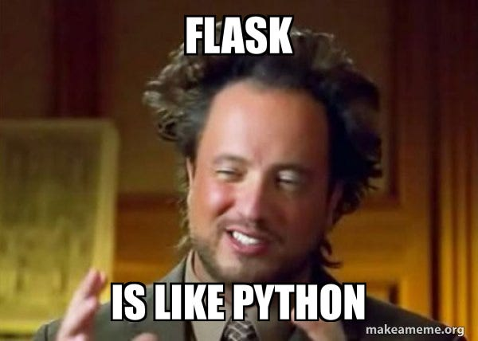

# NYC 031124 Phase 3

## How this works:

Included in this readme are links to each of the repositories we'll be using.

Before each lecture, navigate to the proper repository and run your normal fork / clone. There is no need to create a new branch unless instructed.

## Phase Preview

[Intro to Flask](https://github.com/brewchetta/031124-ph4-01-intro-to-flask)

## Week One

### Day One

[React Refresher](https://github.com/brewchetta/031124-ph4-02-react-refresher)

### Day Two

[Flask Restful Routing](https://github.com/brewchetta/031124-ph4-03-flask-restful-routing)

### Day Three

[Flask Routing Review + React](https://github.com/brewchetta/031124-ph4-04-flask-routing-review)

### Day Four

[Flask Serializer](https://github.com/brewchetta/031124-ph4-05-flask-serializer)

### Day Five

[Flask Validations](#)

## Week Two

### Day One

[Phase 4 Project Prep](#)

### Day Two

[Flask Auth](https://github.com/brewchetta/031124-ph4-06-flask-auth)

## Week Three

### Day Two

[Unit Testing in Python](#)

### Day Three

[Deployment on Render](#)